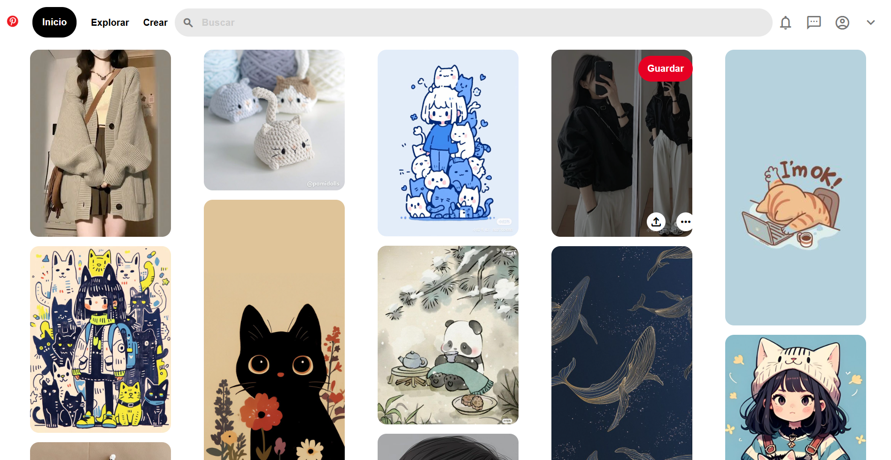

<!-- Los # indican el tamaño de la letra -->
# Clon de pinterest
<!-- *: cursiva, **: negritas, ***: cursivas y negritas -->
¡Hola! ***Soy Valeria Cardós***

A continuación te presento mi clon de pinterest creado en el Bootcamp de Tecnolochicas PRO III 2024.

### El proyecto cuenta con las siguientes secciones
- 📌 Menú

Trae íconos que llevan a la página original de pinterest, una barra de búsqueda, y los botones de perfil del usuario.
- 📷 Imágenes

Cada una de las imágenes cuenta con 3 botones, y de acuerdo al tamaño del dispositivo, el número de rows cambia.

### Fue creado con:
- HTML
- CSS

Listado de herramientas que utilicé:
    
    
    
### Vista previa

### *Si te interesa trabajar conmigo, escríbeme*
*Correo*
[valeokr2e@gmail.com](mailto:valeokr2e@gmail.com)

### Creado en el Bootcamp de Tecnolochicas PRO III 2024 ❤️
[Tecnolochicas PRO](https://tecnolochicas.mx/)